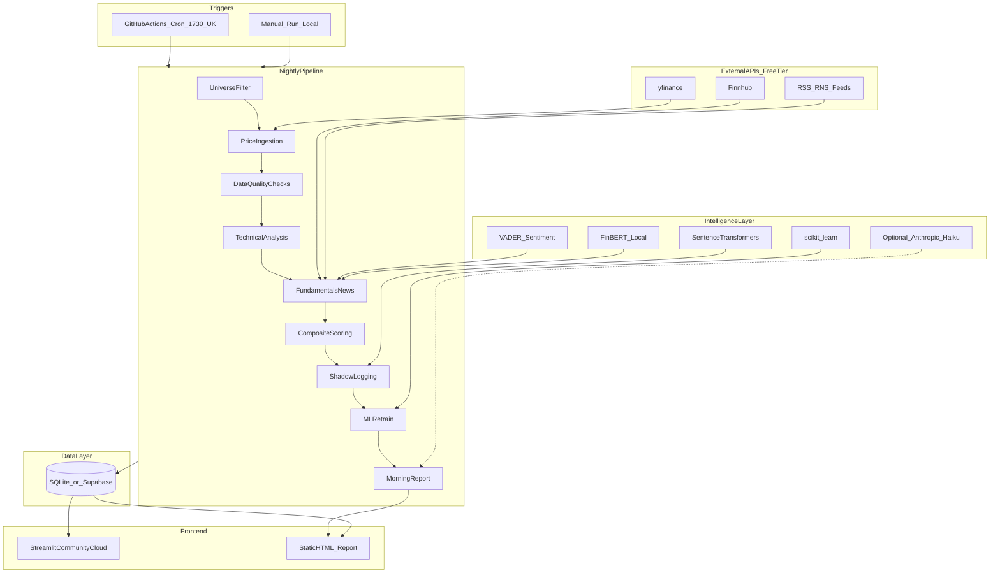
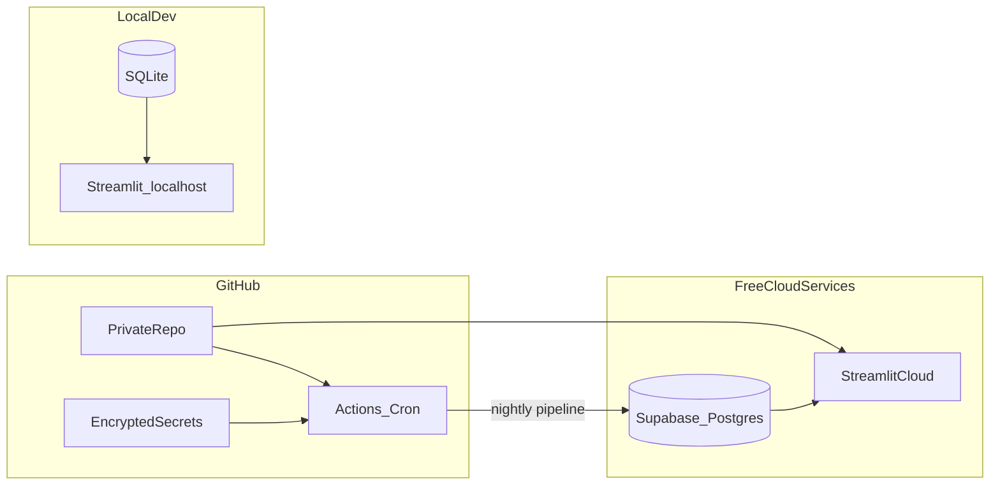

# System Architecture

## Overview

The UK Stock Analyzer is a Python application with three runtime components:

1. **Nightly batch pipeline** — Ingests data, calculates indicators, scores candidates, logs shadow observations
2. **Database** — SQLite (local dev) with optional Supabase PostgreSQL (cloud)
3. **Dashboard** — Streamlit web UI for morning scan, portfolio, patterns, and stock lookup



---

## Why not Vercel?

**Vercel is not suitable for this project.**

| Requirement | Vercel | Our need |
|-------------|--------|----------|
| Language | Node.js / Next.js optimised | Python |
| Long-running jobs | 10–60 second serverless limit | 15–30 min nightly batch |
| Scheduled cron | Limited on free tier | Daily 17:30 UK pipeline |
| SQLite file DB | Ephemeral filesystem | Persistent database |
| ML training | Not supported | scikit-learn on CPU |

### Recommended free hosting stack

| Component | Service | Cost | Why |
|-----------|---------|------|-----|
| Nightly pipeline | **GitHub Actions** (scheduled workflow) | £0 | Runs when PC is off; 2,000 min/month on private repos |
| Dashboard | **Streamlit Community Cloud** | £0 | Native Python/Streamlit hosting; mobile-friendly |
| Database (cloud) | **Supabase** free tier (optional) | £0 | PostgreSQL accessible from Streamlit Cloud and GitHub Actions |
| Database (local dev) | **SQLite** file | £0 | Simple, zero setup for development |
| Secrets | GitHub Actions secrets | £0 | Store API keys (Finnhub, optional Anthropic) |

**Alternative if GitHub Actions limits are hit:** Oracle Cloud Always Free VM (ARM, 24GB RAM) — more setup, still £0.

---

## Frontend

### Technology: Streamlit

- Python-native — same language as pipeline
- Fast to build for a solo non-developer project
- Free hosting via [Streamlit Community Cloud](https://streamlit.io/cloud)
- Plotly charts for daily / weekly / monthly candlesticks

### Views

| View | Purpose | Key components |
|------|---------|----------------|
| `pages/1_morning_scan.py` | Top 5–10 candidates | Ranked table, expander per stock, log observation button |
| `pages/2_portfolio.py` | Open observations | P&L, target/stop proximity alerts |
| `pages/3_patterns.py` | Learning stats | Hit rates, feature importance chart |
| `pages/4_lookup.py` | Ad-hoc ticker search | Full technical + fundamental snapshot |

### Static HTML report

Generated nightly at `reports/morning_YYYY-MM-DD.html` — openable in any browser without starting Streamlit. Useful as a lightweight fallback and email attachment later.

---

## Backend

### Technology: Python 3.11+

No web framework for the pipeline itself — plain Python modules invoked by CLI or GitHub Actions.

### Package structure (planned)

```
src/
  config/           # config.yaml loader, constants
  data/
    prices.py       # yfinance ingestion, GBX normalisation
    fundamentals.py # Finnhub analyst data
    news.py         # RSS/RNS parsing
    universe.py     # FTSE filters, exclusion lists
  analysis/
    indicators.py   # pandas-ta multi-timeframe
    support_resistance.py
    scoring.py      # composite score
  intelligence/
    sentiment.py    # VADER + FinBERT
    catalysts.py    # regex + optional LLM extraction
    patterns.py     # embedding similarity
    ml_model.py     # scikit-learn training/inference
  pipeline/
    nightly.py      # orchestrates full batch
    outcomes.py     # 2/4/8-week tracking
  db/
    schema.sql
    connection.py
    repositories.py
  reports/
    morning_report.py  # Jinja2 HTML generation
scripts/
  run_nightly.py    # CLI entry point
  run_backtest.py
app/
  streamlit_app.py  # main dashboard entry
  pages/            # Streamlit multi-page views
```

### Nightly pipeline steps (17:30 UK, trading days only)

1. Check LSE trading calendar — skip on holidays
2. Update universe (weekly refresh of FTSE constituents)
3. Fetch daily OHLCV for all universe stocks
4. Run data quality checks; quarantine bad tickers
5. Recalculate technical indicators (daily, weekly, monthly)
6. Refresh analyst data (Finnhub; cache 7 days)
7. Parse RSS/RNS for news and catalysts
8. Run sentiment analysis on new articles
9. Update outcome tracking for open observations
10. Retrain ML model if 5+ new outcomes since last train
11. Generate composite scores; rank candidates
12. Shadow-log top 15 candidates
13. Write morning report (HTML + DB)
14. Log scan_run metadata (duration, errors, quarantined tickers)

---

## Database

### Primary: SQLite (local development)

- Zero cost, zero setup
- Single file: `data/stock_analyzer.db`
- Not suitable for Streamlit Cloud alone (ephemeral) — use Supabase for cloud

### Cloud option: Supabase PostgreSQL (free tier)

- 500 MB storage — sufficient for years of daily data on 150 stocks
- Accessible from GitHub Actions and Streamlit Cloud
- Same schema as SQLite (minor dialect differences handled in connection layer)

### Tables

| Table | Purpose |
|-------|---------|
| `stocks` | Filtered universe master list |
| `daily_prices` | OHLCV per stock per date |
| `technical_indicators` | Indicators per stock, date, timeframe |
| `analyst_data` | Consensus targets and ratings |
| `catalysts` | Upcoming dated events |
| `news_items` | Parsed articles with sentiment scores |
| `candidates` | Every nightly ranked row (shadow log) |
| `observations` | User-logged observations with full context |
| `outcomes` | 2/4/8-week performance per observation |
| `pattern_stats` | Rolling hit rates per pattern type |
| `scan_runs` | Pipeline job metadata |
| `data_quality_flags` | Per-ticker quarantine and warning flags |
| `model_versions` | ML artifact metadata and CV metrics |
| `config_snapshots` | Scoring weights used per scan |

---

## APIs and external services

### Free tier (required)

| Service | Usage | Rate limits |
|---------|-------|-------------|
| **yfinance** | Historical and daily OHLCV for `.L` tickers | Unofficial; respect delays |
| **Finnhub** | Analyst recommendations, price targets, company profile | 60 calls/min free |
| **RSS feeds** | Reuters UK, RNS, FT Markets, Proactive Investors | No key required |
| **LSE RNS** | Catalyst dates, regulatory announcements | Parse from RSS/HTML |

### Optional paid (quality upgrade, ~£3–5/month)

| Service | Usage | When to add |
|---------|-------|-------------|
| **Anthropic API (Haiku)** | Morning candidate prose summaries, ambiguous catalyst extraction | When templates feel too dry |
| **Groq free tier** | Fast local-class LLM via API | Alternative to Anthropic for extraction |

### Not used

- Stockopedia / Simply Wall St scraping (fragile, ToS risk)
- Bloomberg / LSEG paid terminals
- Vercel / Railway (wrong fit or not free)

---

## Services and libraries

### Data and analysis

| Library | Role |
|---------|------|
| `pandas` | Data manipulation |
| `pandas-ta` | Technical indicators |
| `numpy` | Numerical operations |
| `yfinance` | Price data |
| `feedparser` | RSS parsing |

### Intelligence

| Library | Role |
|---------|------|
| `vaderSentiment` | Headline polarity (fast, free) |
| `transformers` + `ProsusAI/finbert` | Financial sentiment (accurate, local CPU) |
| `sentence-transformers` | Pattern description embeddings |
| `scikit-learn` | Random Forest / logistic regression |
| `anthropic` (optional) | Haiku for prose summaries |

### Frontend and reports

| Library | Role |
|---------|------|
| `streamlit` | Dashboard |
| `plotly` | Interactive candlestick charts |
| `jinja2` | HTML morning report templates |

### Infrastructure

| Tool | Role |
|------|------|
| `pytest` | Tests |
| `python-dotenv` | Local secrets |
| GitHub Actions | Scheduled pipeline |
| Streamlit Community Cloud | Dashboard hosting |

---

## Security

- API keys in `.env` locally (never committed)
- GitHub Actions secrets for `FINNHUB_API_KEY`, optional `ANTHROPIC_API_KEY`
- `.gitignore` excludes `data/*.db`, `.env`, `models/*.pkl`
- Private GitHub repository

---

## Deployment architecture



### Data flow (production)

1. GitHub Actions runs `scripts/run_nightly.py` at 17:30 UK on weekdays
2. Pipeline writes to Supabase PostgreSQL
3. Streamlit Community Cloud reads from Supabase and displays dashboard
4. Static HTML report committed to `reports/` or stored in Supabase storage (optional)

### Data flow (local development)

1. Run `python scripts/run_nightly.py` manually or via Task Scheduler
2. Pipeline writes to local SQLite
3. Run `streamlit run app/streamlit_app.py` for dashboard

---

## Error handling and observability

- Structured logging to `logs/pipeline_YYYY-MM-DD.log`
- `scan_runs` table records success/failure, duration, quarantined count
- GitHub Actions workflow sends email on failure (built-in notification)
- Data quality flags prevent bad prices from affecting scores

---

## Future extensions (out of scope for v1)

- Interactive Investor CSV import for portfolio sync
- Email morning digest via Gmail SMTP
- Mobile PWA wrapper around Streamlit
- Oracle Cloud VM if GitHub Actions minutes exhausted
