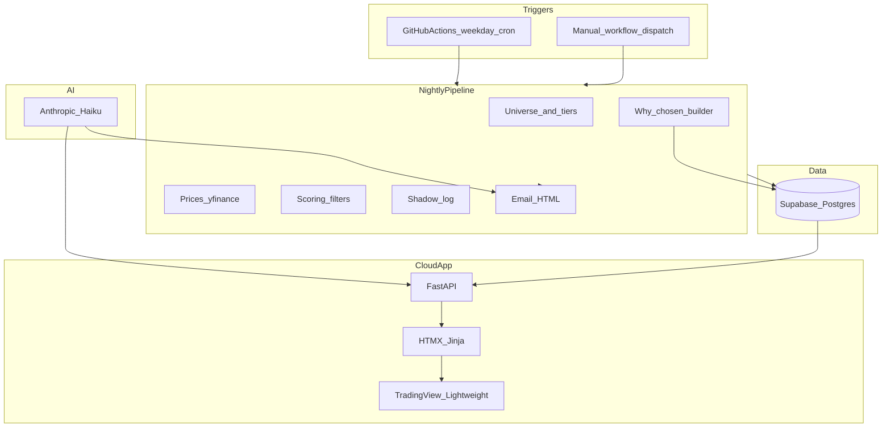

# System Architecture (v2)

Last updated: 2026-07-14

## Overview

Three runtime components:

1. **Nightly batch pipeline** — GitHub Actions, Python, scores FTSE universe, emails digest
2. **Database** — Supabase PostgreSQL (SQLite for local tests)
3. **Web app** — FastAPI + HTMX/Jinja on Render/Railway (Streamlit deprecated)



## Hosting

| Component | Service | Notes |
|-----------|---------|-------|
| Nightly job | GitHub Actions | Single primary weekday cron + DST companion; concurrency cancels duplicates |
| Database | Supabase Postgres | Shared by pipeline and web app |
| Web UI | Render or Railway | FastAPI `uvicorn`, always-on or light sleep |
| Email | Gmail SMTP from Actions | Independent of web app |

**Not used:** Vercel for batch; Streamlit Cloud as primary UI.

## Package layout

```
src/                 # Shared library (pipeline, scoring, db, intelligence)
webapp/              # FastAPI application (v2 UI)
  main.py
  routes/
  templates/
  static/
app/                 # Legacy Streamlit (deprecated)
scripts/             # CLI entry points
config/              # config.yaml
docs/                # Specs and rebuild docs
```

## Data flow (morning)

1. Cron starts ~05:00 UK (may be delayed by GitHub)
2. Gate: weekday + not already completed today (late starts still run)
3. Tiered universe → prices → score → shadow log top 15
4. Build `why_chosen` for shortlist
5. Email HTML + optional Haiku prose
6. Web app reads same DB for shortlist, charts, coaching

## External data

| Source | Use |
|--------|-----|
| yfinance | OHLCV, fundamentals (primary; prices in GBX) |
| RSS | News / catalyst heuristics |
| Anthropic Haiku | Morning prose + coaching critique (optional) |
| Investing.com / Yahoo | External links for user research (not primary price feed) |

## Deprecated (v1)

- Streamlit as primary dashboard
- Plotly-in-Streamlit as primary chart
- Investing.com **search** URLs as stock links
- Multiple overlapping crons with `cancel-in-progress: false`
