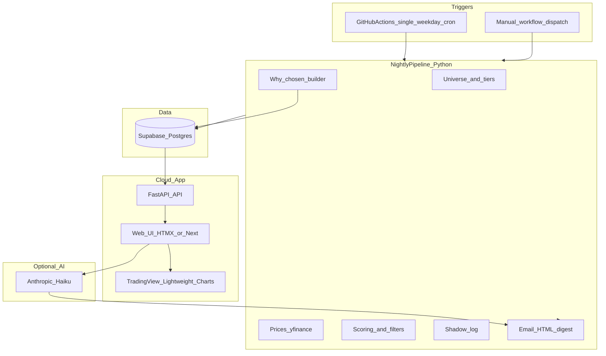
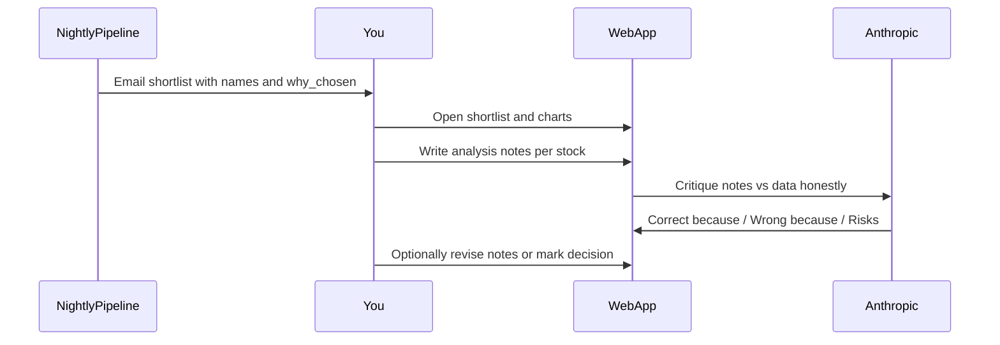

# UK Stock Analyzer — Rebuild Plan (v2)

> **In-repo copy** of the Cursor plan (`~/.cursor/plans/rebuild_architecture_plan_*.plan.md`).
> Live checklists: [tasks.md](tasks.md) · [progress.md](progress.md) · [rebuild_brief.md](rebuild_brief.md)

Last updated: 2026-07-14

## Verdict on your pain points

| Problem | Root cause (today) | Rebuild direction |
|---------|-------------------|-------------------|
| Streamlit unusable | Free Cloud cold starts + heavy Python re-runs per click | Replace Streamlit with a real web app |
| No email / late / two jobs | Dual/triple GitHub crons + concurrency queue + Actions delay | One weekday cron + no overlapping waits |
| “Lower tier” stocks | Filters/weights optimise relative rank, not “quality feel”; FTSE 250 mid/small can still pass | Quality gates + explainability + optional liquidity/quality floor |
| No company name | UI/email show ticker only | Persist and display `name` everywhere |
| Investing.com wrong page | Links use **search** URL (`/search/?q=BT.A`), not instrument page | Map epic → proper Investing.com slug/URL (or Yahoo/LSE fallback) |
| Price/chart mismatch | **yfinance** vs Investing.com (currency, adjusted close, delays, ticker aliases like BT-A vs BT.A) | Document source of truth; improve ticker normalisation; optional second-source check |
| Charts terrible | Plotly inside Streamlit is clunky/slow | **TradingView Lightweight Charts** (or TradingView widget) in new UI |
| ML opaque | Model inactive until ~100 outcomes; no “what learned” narrative | ML status page + feature importance in plain English + shadow outcome stats |
| Why chosen unclear | Score breakdown exists partially; catalysts buried | Per-stock **Why shortlisted** card (factors + catalysts + conflicts) |
| No coaching loop | Observation form is one-way | Shortlist → your notes → **honest AI critique** step |

**Recommended scope:** Keep GitHub Actions + Supabase + Python scoring pipeline. Rebuild the product surface (UI, explanations, coaching, reliability). Treat current Streamlit app as a prototype.

---

## Target architecture (v2)

### Cloud UI options (decision)

| Option | Speed | Skill fit | Charts | Recommendation |
|--------|-------|-----------|--------|----------------|
| **A. FastAPI + HTMX/Jinja** (hosted on Render/Railway/Fly) | Fast | Best for you (mostly Python) | TradingView JS embed | **Primary recommendation** |
| B. Next.js + FastAPI | Fastest polish | More frontend work | Excellent | Later upgrade if needed |
| C. NiceGUI / Reflex | Medium | Python-only | OK | Backup if you refuse any HTML/JS |
| D. Keep Streamlit | Too slow | Already proven bad | Poor | **Do not keep as primary UI** |

**Plan default:** Option A — FastAPI API + simple pages, deploy on **Render** or **Railway** (free/cheap tier), password login, same Supabase DB.

Email remains independent of the web app (GitHub Actions → Gmail).

---

## Product workflow

---

## Documentation pack

| Doc | Purpose |
|-----|---------|
| [rebuild_brief.md](rebuild_brief.md) | Problems, goals, non-goals, success criteria |
| [architecture.md](architecture.md) | Components, hosting, data flow, deprecated |
| [tasks.md](tasks.md) | Ordered checklist |
| [decisions.md](decisions.md) | ADRs including FastAPI, charts, cron |
| [progress.md](progress.md) | Phase tracker |
| [ux_spec.md](ux_spec.md) | Screens, coaching, charts |
| [data_quality.md](data_quality.md) | yfinance vs Investing, aliases, GBX |
| [webapp_deploy.md](webapp_deploy.md) | Render/Railway deploy |

---

## Phase plan

### Phase R0 — Stabilize reliability

- Single primary weekday cron + DST companion; `cancel-in-progress: true`
- Late run still runs; clear `SKIPPED:` / status in logs
- App home: last scan, last run status, results-by hour
- Manual “Run now” remains

### Phase R1 — Docs + product spec

- All docs above written

### Phase R2 — Replace Streamlit

- FastAPI + Jinja: login, shortlist, stock detail, holdings, notes, ML, lookup
- Deploy to Render/Railway (ops step)
- Retire Streamlit Cloud as primary

### Phase R3 — Data clarity

- Company name + ticker everywhere
- Investing slug map + Yahoo fallback
- TradingView Lightweight Charts (candles + volume; D/W/M)
- Price source disclaimer
- Ticker normalisation (BT-A / BT.A, etc.)

### Phase R4 — Why shortlisted

- Persist `why_chosen` JSON per candidate
- UI card + email bullets
- Optional `conflict_penalty` quality feel

### Phase R5 — ML transparency

- Outcomes N/100, model meta, shadow hit rates, feature importance
- Explicit inactive vs active

### Phase R6 — Coaching conversation

- Analysis notes + honest Haiku critique
- Store and show on detail/notes pages

### Phase R7 — UX polish

- Single holdings table; “Awaiting scan” for blank prices
- Mobile-friendly; consistent terminology
- Chart timeframe toggle; lookup page; score breakdown

---

## Explicit non-goals

- Not rebuilding batch on Vercel
- Not switching to a paid primary price API unless yfinance fails audit
- Not claiming ML edge before ~100 labelled outcomes
- Not keeping Streamlit as the main product UI

---

## Success criteria

1. Weekday email most days before **07:00 UK** (or clear late status)
2. Only **one** full pipeline per weekday
3. App usable on phone; chart zoom/pan works
4. Every shortlisted stock shows **name + why chosen + catalysts**
5. External link opens the right instrument ≥90% for shortlist
6. Analysis + **blunt AI critique** stored
7. ML status obvious on one screen

---

## Suggested order of work

1. Docs → 2. R0 schedule → 3. R2 UI → 4. R3 trust/charts → 5. R4 why-chosen → 6. R6 coaching → 7. R5 ML + R7 polish
